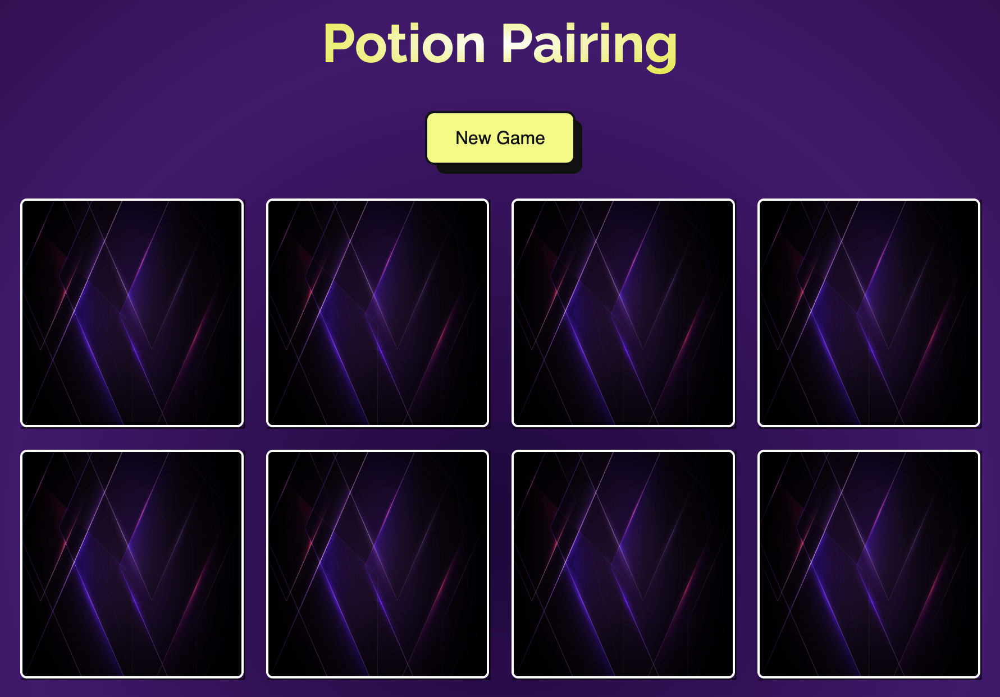
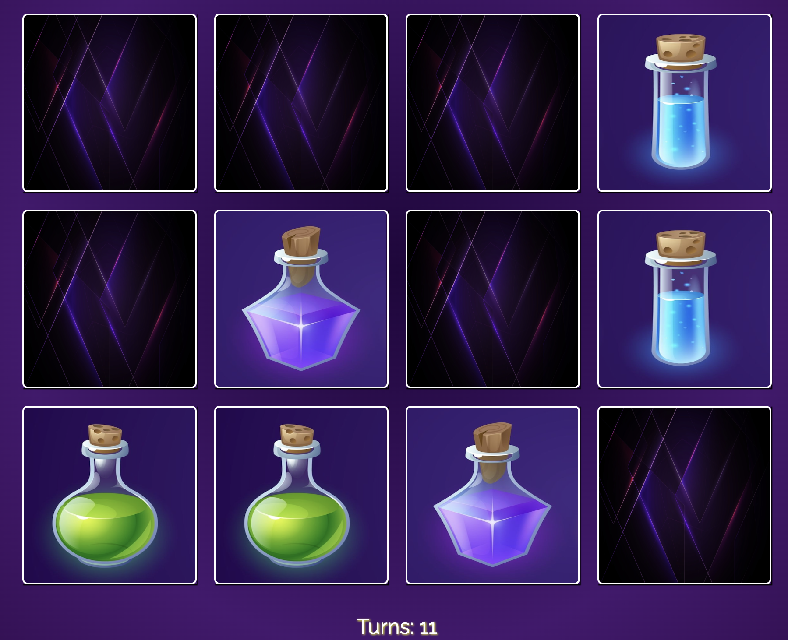

# Potion Pairing

## License
### 
### [MIT](https://opensource.org/licenses/MIT)

## Description

React based card pairing app made primarily through useState and useEffect methods.

By: [Vincent Toon](https://github.com/Vincenttoon)

## Table of Contents

* [Live Link](https://potionpairing-vwtd.vercel.app/)

* [Installation](#installation)

* [Usage](#usage)  

* [Things Learned](#things-learned)

* [Future Improvements](#future-improvements)

* [Contributors](#contributors)

* [Questions?](#questions)

## Live Link

[Potion Pairing Live Deployment](https://potionpairing-vwtd.vercel.app/)

## Installation

* Head to the repository to download or view this code: [Potion Pairing](https://github.com/Vincenttoon/magic-memory)

## Usage

- Go to webpage 
- Click a card to reveal its front 
- Find its match and complete the board
- Play again!

## Things Learned

- Further Understanding of React
- More practice with `useState()` and `useEffect()`
- Use of `.sort()`, which I haven't used in a while.
- More practice with `transform`, `translate`, `transition`, `touch-action` in CSS3

## Contributors

* Potions from [Kylaksun](https://www.shutterstock.com/g/klyaksun) on Shutterstock.
* Card Back from [Nobody_man](https://www.shutterstock.com/g/Aneg+Gatpiboon) on Shutterstock.

## Questions?

Questions, comments, or concerns? Please Email me at:
* vincenttoon22@gmail.com

- `.sort()`